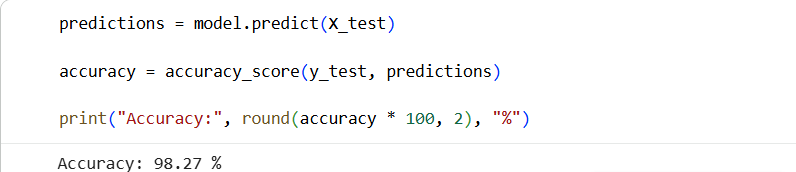

# Fake News Detection System

## Overview
This project uses Machine Learning and Natural Language Processing (NLP) to classify news articles as Fake or Real.

## Technologies Used
- Python
- Pandas
- NumPy
- Scikit-learn
- Google Colab

## Model Used
- TF-IDF Vectorization
- Logistic Regression

## Result
Achieved approximately 98% accuracy on the test dataset.

## Screenshot

## Author
Lahari Kemburi
